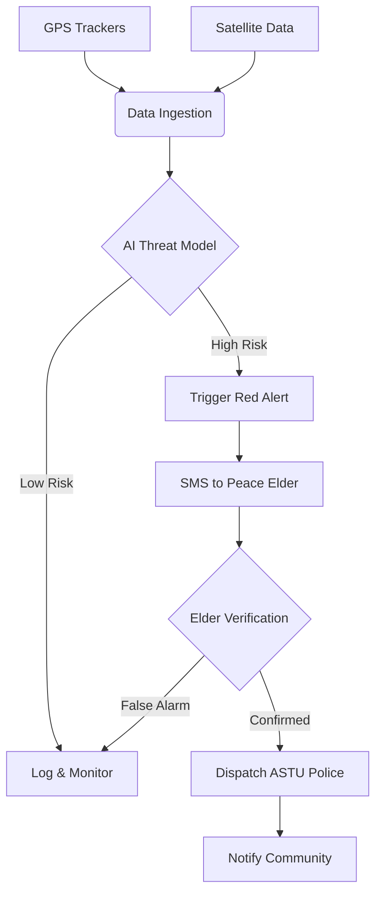

# 🛡️ Ulinzi Project - AI-Powered Cattle Rustling Prevention

**Ulinzi** (Swahili for "Protection") is an advanced AI-driven system designed to predict, detect, and prevent cattle rustling in Kenya's arid and semi-arid lands (ASALs). It combines satellite data, machine learning, and community-based verification to provide actionable intelligence to security forces and local peace elders.

  

---

## 🚀 Features

### 1. Regional Command Dashboard
A high-level strategic view for monitoring threat levels across multiple counties.
-   **Live Satellite Map:** Real-time visualization of threat zones using `CartoDB Dark Matter` tiles.
-   **Predictive Analytics:** LSTM (Long Short-Term Memory) models forecast future threat levels based on historical data.
-   **Dynamic Filtering:** Filter regions by threat severity (1-5).
-   **Interactive Charts:** Historical trend analysis using Altair.

### 2. GrazingGuard (Tactical Ops)
A specialized module for real-time tracking of individual cattle herds.
-   **GPS Simulation:** Simulates cattle movement patterns (grazing vs. raiding).
-   **Anomaly Detection:** Uses `Isolation Forest` to detect unusual movement vectors indicative of a raid (e.g., high speed at night).
-   **Human-in-the-Loop Verification:**
    -   **SMS Integration:** Automatically alerts local Chiefs via SMS (using **TextBee**) when a threat is detected.
    -   **2-Way Communication:** Waits for confirmation ("YES/NO") from the Chief before dispatching police.
-   **Tactical UI:** "NSA-style" dark mode interface with neon accents for high-contrast visibility in field operations.

---

## 🛠️ Technology Stack

### Core Frameworks
-   **Python 3.11:** Primary programming language.
-   **Streamlit:** Web application framework for the dashboard.

### Data Science & AI
-   **Pandas & NumPy:** Data manipulation and simulation.
-   **Scikit-Learn:** `IsolationForest` for anomaly detection in cattle movement.
-   **PyTorch:** `LSTM` neural networks for regional threat forecasting.

### Visualization
-   **Folium:** Interactive maps with satellite imagery overlays.
-   **Plotly:** High-performance scatter plots for live cattle tracking.
-   **Altair:** Declarative statistical visualization for charts.
-   **Graphviz:** Workflow and architecture diagrams.

### Communication
-   **TextBee:** Self-hosted Android SMS gateway for sending alerts and polling for replies.

---

### Prerequisites
-   Python 3.10 or higher.
-   An Android phone with the **TextBee** app installed (for SMS features).

### 🛠️ Installation & Setup

1.  **Clone the Repository**
    ```bash
    git clone https://github.com/your-repo/ulinzi-project.git
    cd ulinzi-project
    ```

2.  **Create Virtual Environment**
    ```bash
    python3 -m venv .venv
    source .venv/bin/activate
    ```

3.  **Install Dependencies**
    ```bash
    pip install -r requirements.txt
    ```

## 🚀 Usage

The system is split into a **Backend API** and a **Frontend Dashboard**. You need to run both in separate terminals.

### Terminal 1: Start Backend
```bash
source .venv/bin/activate
uvicorn backend.main:app --reload
```
*Server will start at `http://localhost:8000`*

### Terminal 2: Start Frontend
```bash
source .venv/bin/activate
streamlit run frontend/app.py
```
*Dashboard will open at `http://localhost:8501`*

## 🔑 Login Credentials
- **Username:** `admin`
- **Password:** `niruhack123`
2.  Get your `API Key` and `Device ID` from the app.
3.  Update `grazing_guard.py` with your credentials (or set them as environment variables).

---


### Running the Application
```bash
streamlit run app.py
```

### Mode 1: Regional Dashboard
1.  **Select Region:** Use the sidebar dropdown to choose a county (e.g., "Turkana County").
2.  **Monitor Threats:** View the map for red/orange markers indicating high-risk zones.
3.  **Analyze Trends:** Check the "Threat Level History" chart.
4.  **AI Prediction:** Look at the "Predicted Next Threat Level" to see the forecast for the next 24 hours.

### Mode 2: GrazingGuard (Cattle Tracking)
1.  **Switch Mode:** Select "GrazingGuard" from the sidebar navigation.
2.  **Select Sector:** Ensure the correct county is selected in the top dropdown.
3.  **Simulation Control:**
    -   **Normal Grazing:** Simulates safe, daytime cattle movement.
    -   **Simulate Raid:** Simulates a high-speed theft event at night.
4.  **Threat Response:**
    -   When a raid is simulated, the system enters **THREAT DETECTED** mode.
    -   Click **"Send SMS Alert to Chief"**.
    -   The system enters **WAITING FOR CHIEF** mode and polls for a reply.
    -   **Reply:** If the Chief replies "CONFIRM" or "YES", the system transitions to **DISPATCHED**.

---

## 🧩 System Architecture



---

## 🔮 Future Roadmap
-   [ ] **LoRaWAN Integration:** Replace simulated GPS data with real hardware sensors.
-   [ ] **Drone Deployment:** Auto-dispatch surveillance drones upon confirmed threats.
-   [ ] **Voice AI:** IVR calls to elders in local dialects (Turkana, Pokot).
-   [ ] **Offline Mode:** SMS-based reporting for areas with no internet.

---

*Built for the NIRU Hackathon 2025.*
